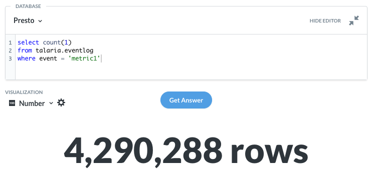
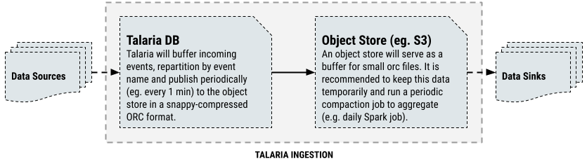
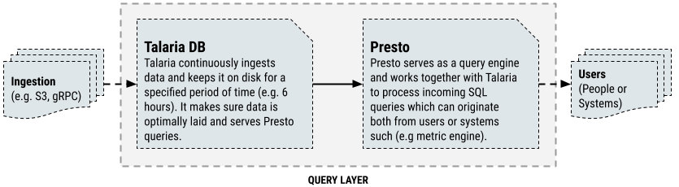

# Talaria

 

[](https://goreportcard.com/report/github.com/kelindar/talaria)
[](https://hub.docker.com/repository/docker/kelindar/talaria/general)


This repository contains a fork of TalariaDB, a distributed, highly available, and low latency time-series database for Big Data systems. It was originally [designed and implemented in Grab](https://engineering.grab.com/big-data-real-time-presto-talariadb), where millions and millions of transactions and connections take place every day , which requires a platform scalable data-driven decision making. 

<p align="center">
    
</p>

## Introduction

TalariaDB helped us to overcome the challenge of retrieving and acting upon the information from large amounts of data. It addressed our need to query at least 2-3 terabytes of data per hour with predictable low query latency and low cost. Most importantly, it plays very nicely with the different tools’ ecosystems and lets us query data using SQL.


From the original design, we have extended Talaria to be setup in a two possible ways:

 1. As an **event ingestion platform**. This allows you to track events using a simple gRPC endpoint from almost anywhere.
 2. As a **data store for hot data**. This allows you to query hot data (e.g. last 6 hours) as it goes through the data pipeline and ultimately ends up in your data lake when compacted.

Talaria is designed around event-based data model. An event is essentially a set of key-value pairs, however to make it consistent we need to define a set of commonly used keys.
Each event will consist of the following:

* Hash key (e.g: using "event" key). This represents the type of the event and could be prefixed with the source scope (eg. "table1") and using the dot as a logical separator. The separation and namespacing is not required, but strongly recommended to make your system more usable.
* Sort key (e.g: using "time" key). This represents the time at which the update has occurred, in unix timestamp (as precise as the source allows) and encoded as a 64-bit integer value.
* Other key-value pairs will represent various values of the columns.

Below is an example of what a payload for an event describing a table update might look like.

| KEY         | VALUE               | DATA TYPE   |
|-------------|---------------------|-------------|
| **event**   | table1.update       | `string`    |
| **time**    | 1586500157          | `int64`     |
| **column1** | hello               | `string`    |
| **column2** | { "name": "roman" } | `json`      |

Talaria sypports `string`, `int32`, `int64`, `bool`, `float64`, `timestamp` and `json` data types which are used to construct columns that can be exposed to Presto/SQL.

## Event Ingestion with Talaria

If your organisation needs a reliable and scalable data ingestion platform, you can set up Talaria as one. The main advantage is that such platform is cost-efficient, does not require a complex Kafka setup and even offers in-flight query if you also point a Presto on it. The basic setup allows you to track events using a simple gRPC endpoint from almost anywhere.



In order to setup Talaria as an ingestion platform, you will need specify a table, in this case "eventlog", and enable `compaction` in the configuration, something along these lines:

```yaml
mode: staging
env: staging
domain: "talaria-headless.default.svc.cluster.local"
storage:
  dir: "/data"
tables:
  eventlog:
    compact:                               # enable compaction
      interval: 60                         # compact every 60 seconds
      nameFunc: "s3://bucket/namefunc.lua" # file name function
      s3:                                  # sink to Amazon S3
        region: "ap-southeast-1"
        bucket: "bucket"
...
```

Once this is set up, you can point a gRPC client (see [protobuf definition](proto/talaria.proto)) directly to the ingestion endpoint. Note that we also offer some pre-generated or pre-made ingestion clients [in this repository](/client/).

```
service Ingress {
  rpc Ingest(IngestRequest) returns (IngestResponse) {}
}
```

Below is a list of currently supported sinks and their example configurations:
- [Amazon S3](https://aws.amazon.com/s3/) using [s3 sink](./internal/storage/writer/s3).
- [DigitalOcean Spaces](https://www.digitalocean.com/products/spaces/) using [s3 sink](./internal/storage/writer/s3), a custom endpoint and us-east-1 region.
- [Google Cloud Storage](https://cloud.google.com/storage/) using [gcs sink](./internal/storage/writer/gcs).
- Local filesystem using [file sink](./internal/storage/writer/file).
- [Microsoft Azure Blob Storage](https://azure.microsoft.com/en-us/services/storage/blobs/) using [azure sink](./internal/storage/writer/azure).
- [Minio](https://min.io/) using [s3 sink](./internal/storage/writer/s3), a custom endpoint and us-east-1 region.
- [Google Big Query](https://cloud.google.com/bigquery/) using [bigquery sink](./internal/storage/writer/bigquery).
- Talaria itself using [talaria sink](./internal/storage/writer/talaria).

## Hot Data Query with Talaria

If your organisation requires querying of either hot data (e.g. last n hours) or in-flight data (i.e as ingested), you can also configure Talaria to serve it to Presto using built-in [Presto Thrift](https://prestodb.io/docs/current/connector/thrift.html) connector. 



In the example configuration below we're setting up an `s3 + sqs` writer to continously ingest files from an S3 bucket and an "eventlog" table which will be exposed to Presto.

```yaml
mode: staging
env: staging
domain: "talaria-headless.default.svc.cluster.local"
writers:
  grpc:
    port: 8080
  s3sqs:
    region: "ap-southeast-1"
    queue: "queue-url"
    waitTimeout: 1
    retries: 5
readers:
  presto:
    schema: data
    port: 8042
storage:
  dir: "/data"
tables:
  eventlog:
    ttl: 3600         # data is persisted for 1 hour
    hashBy: event
    sortBy: time
...
```

Once you have set up Talaria, you'll need to configure Presto to talk to it using the [Thrift Connector](https://prestodb.io/docs/current/connector/thrift.html). You would need to make sure that:
 1. In the properties file you have configured to talk to Talaria through a kubernetes load balancer.
 2. Presto can access directly the nodes, without the load balancer.

Once this is done, you should be able to query your data via Presto.

```sql
select * 
from talaria.data.eventlog
where event = 'table1.update'
limit 1000
```


## Quick Start

The easiest way to get started would be using the provided [helm chart](https://github.com/crphang/charts/tree/master/talaria).

## Contributing

We are open to contributions, feel free to submit a pull request and we'll review it as quickly as we can. TalariaDB is maintained by:
* [Roman Atachiants](https://www.linkedin.com/in/atachiants/)
* [Yichao Wang](https://www.linkedin.com/in/wangyichao/)
* [Chun Rong Phang](https://www.linkedin.com/in/phang-chun-rong-6232ab78/)
* [Ankit Kumar Sinha](https://www.linkedin.com/in/ankit-kumar-sinha-805359b6/)

## License

TalariaDB is licensed under the [MIT License](LICENSE.md).